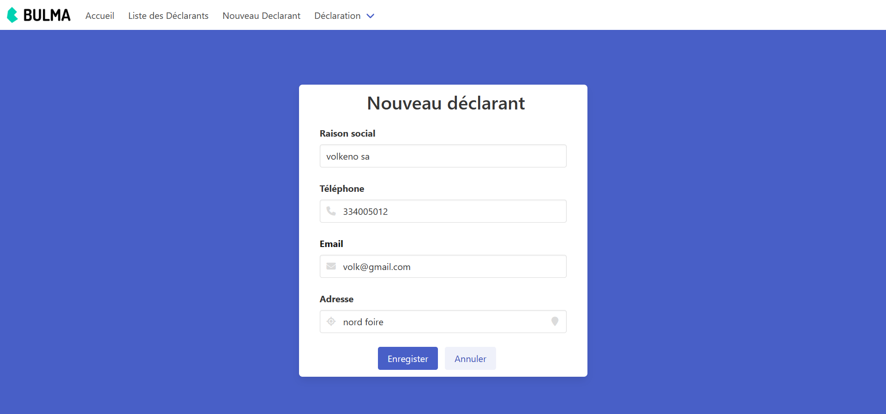
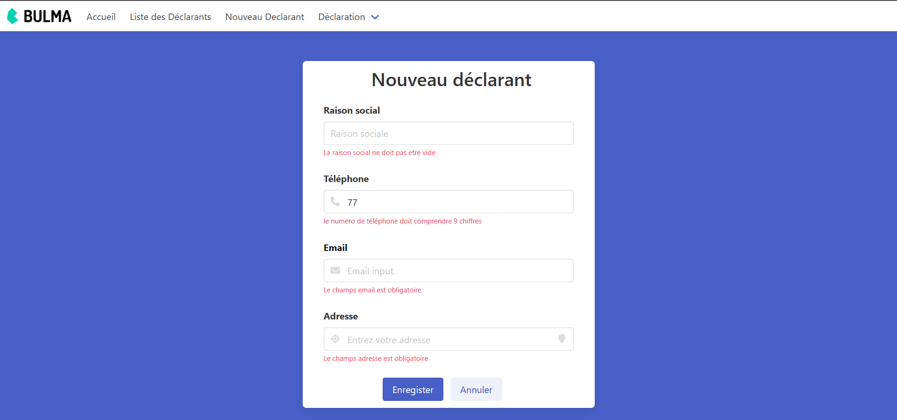
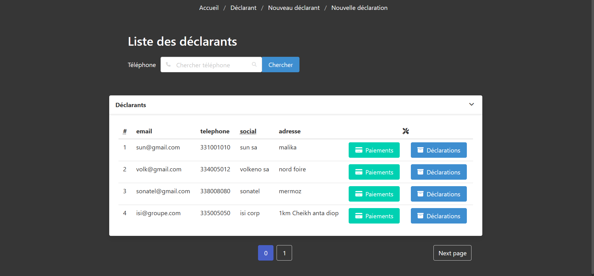
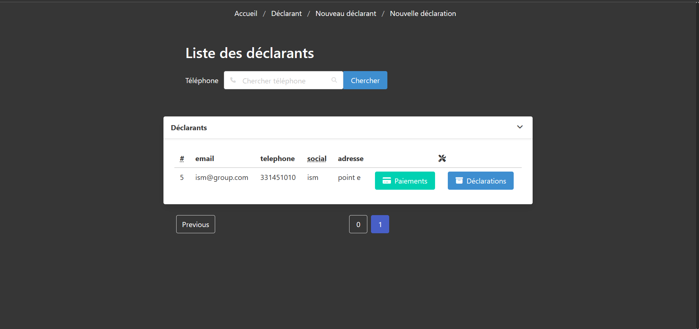
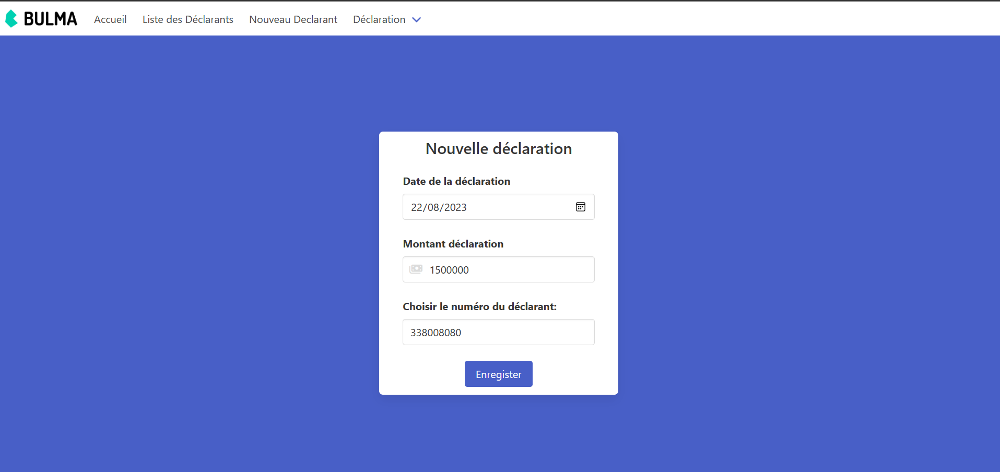
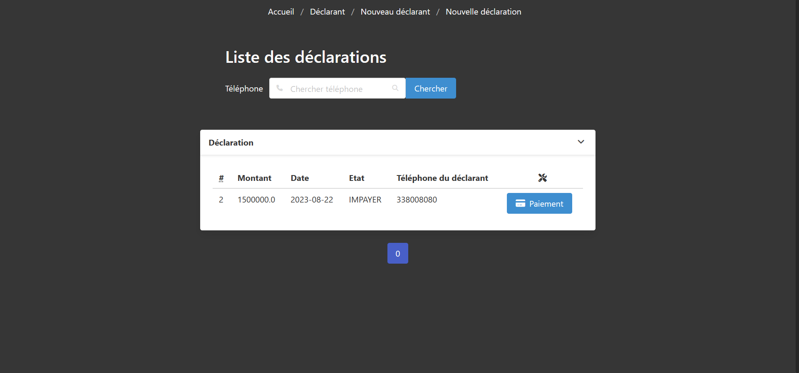
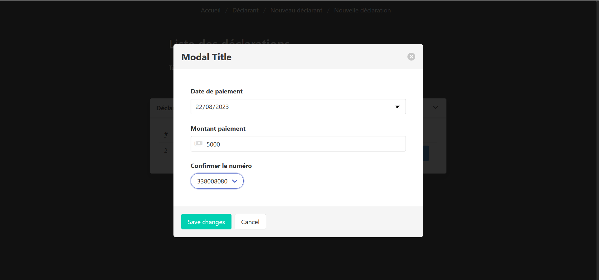
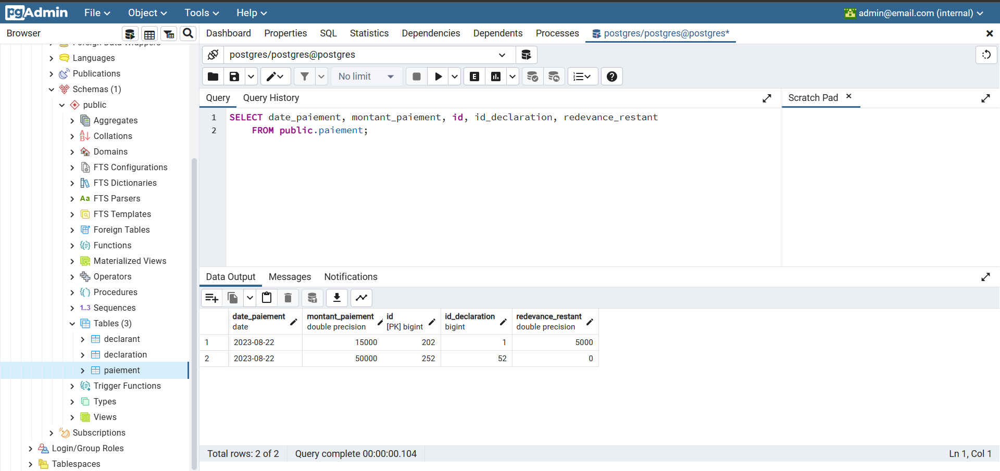
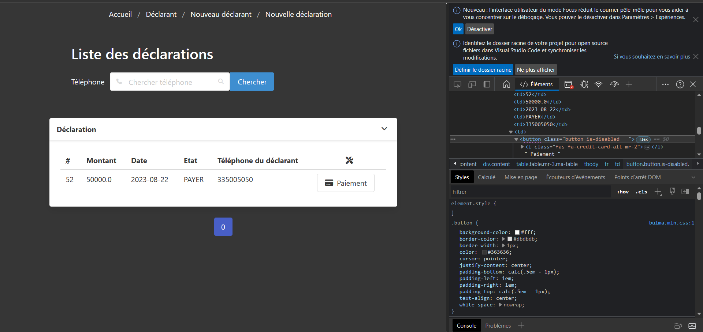

#   systeme de régularisation des impôts
### lancez les containeur  docker de postgresql et pgadmin avec terminal avec la commande `docker-compose up `
### Le pgadmin se lance au port `localhost:5050`
 les identifiants sont email :  ```` admin@email.com ```` 
mot de passe   ```admin``` 
### Plus de détails consultés le fichier compose.yml


## Ajout déclarant

##   contrainte de validation ajout déclarant depuis le dto

## Liste des déclarants

## Pagination de la liste

## Ajout déclaration

## Pagination de  la liste des déclarations

## Ajout d'un  paiement

## Liste de paiement
### Redevance restant ou montant dû
Ici la redevance restant représente la soustraction entre le
montant de déclaration et le montant payé.
Une fois une déclaration completement réglée
la redevance est égale à 0 dans ce cas on désactive le bouton paiement de l'utilisateur 

#### Désactivation du bouton paiement 

